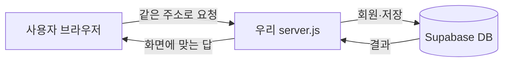
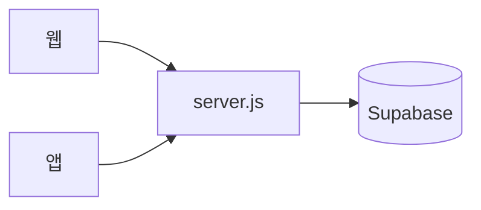

# 폴더 한눈에 보기 (안 꼬이게 쓰는 법)

```
sentence-craft/
├── public/              ← 화면(HTML, 나중에 CSS/이미지). 여기만 보면 됨
├── config/              ← 게임 규칙 “표” (영토, 정치색 숫자 뼈대)
├── docs/                ← 사람이 읽는 설명서 (기획, Supabase 안내)
├── supabase/            ← 데이터베이스 설계 SQL
├── app-config.js        ← 예전부터 쓰던 큰 설정 + 위 config를 묶어서 API로 내려줌
├── server.js            ← 우리 집 “접수 창구” (웹 요청 받기 + Supabase 연결)
├── package.json         ← 필요한 도구 목록
└── .env                 ← 비밀 주소·열쇠 (Git에 올리지 말 것)
```

## 데이터가 흐르는 그림



## 웹 + 앱 (둘 다 같은 집)



자세한 설명: **`docs/웹과앱_같이쓰기.md`**

- **규칙 숫자**는 `config/` 와 `app-config.js` 쪽을 먼저 봅니다.  
- **화면**은 `public/` 만 건드리면 다른 부분과 덜 엉킵니다.
