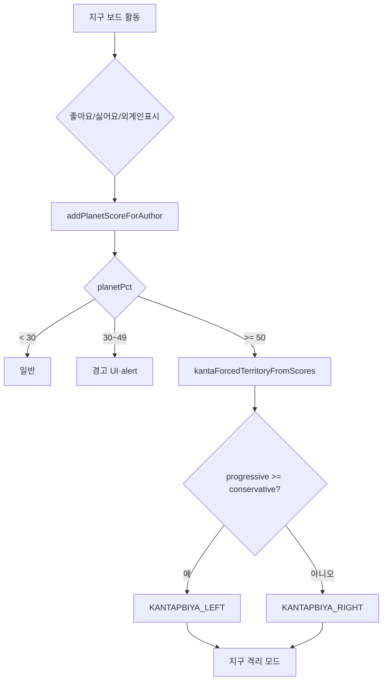
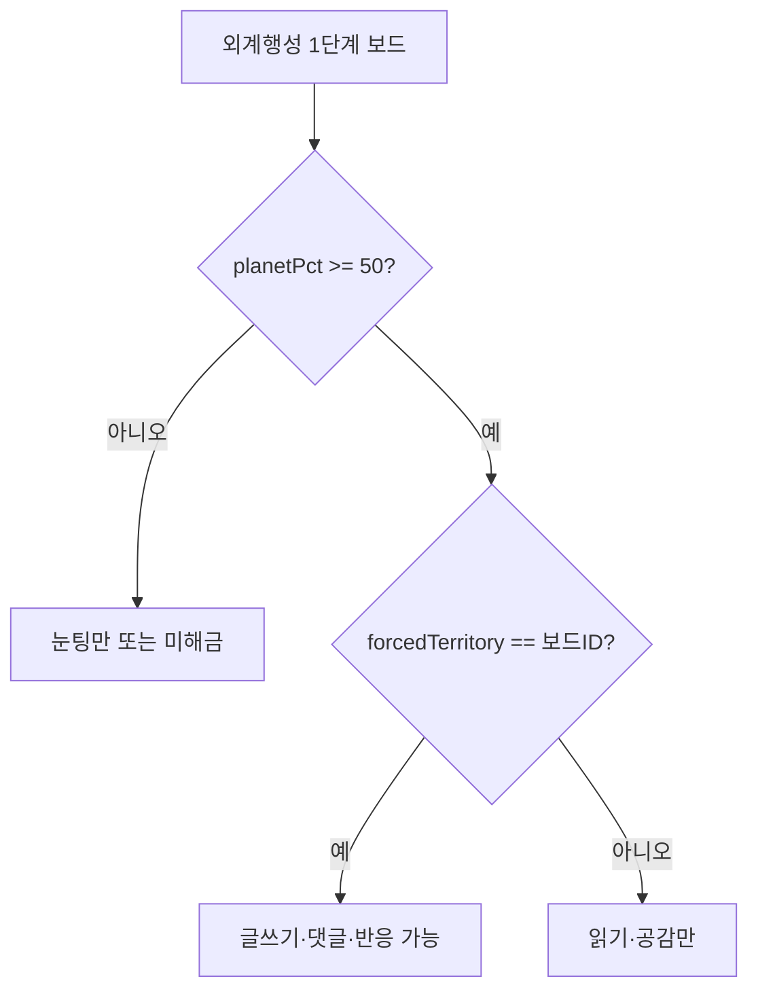

# 외계행성(KANTAPBIYA) — 조건·소속·해금·격리 로직 일람

다른 도구/AI와 **상의용**으로 그대로 복사해 쓰면 됩니다.  
구현 기준: **`public/index.html`** (게시판 IIFE) + **`public/alignment-scoring.js`** + **`config/kantapbiya.js`** + **`app-config.js`**.

관련 수치 튜닝: [`docs/ALIGNMENT_REACTION_TUNING.md`](./ALIGNMENT_REACTION_TUNING.md)  
레벨·눈팅: [`docs/PLAYER_LEVEL_PROGRESSION.md`](./PLAYER_LEVEL_PROGRESSION.md)

---

## 0. 한 줄 요약 (AI용)

> 외계행성 **맵 이동**은 누구나 가능하지만, **소속·글쓰기**는 `planetPct` **50%** 이상으로 `forcedTerritory`가 잡혀야 한다. LEFT/RIGHT는 사람 축 **진보 vs 보수**로 자동 배정(동률이면 진보행성). 소속 후 **지구(중앙광장·진영 1단계)** 는 읽기·공감·좋아요만 가능하다. `planetPct`는 **지구 보드**에서 받은 좋아요(+2)·싫어요(+3)·외계인 표시(±10)로 쌓인다.

---

## 1. 영토 ID

| 구분 | ID | 한글 라벨 |
|------|-----|-----------|
| 중앙광장 | `COMMON` | 중앙광장 |
| 지구 진영 | `CONSERVATIVE` | 보수 |
| 지구 진영 | `PROGRESSIVE` | 진보 |
| 외계행성 | `KANTAPBIYA_LEFT` | 외계행성 · 진보행성 |
| 외계행성 | `KANTAPBIYA_RIGHT` | 외계행성 · 보수행성 |

- 외계행성도 **4단계 게시판 구조**(`isFourTier`)이나 **3·4단계는 미공개** (`isFactionStageUnlocked` → `st >= 3` 이면 `false`).
- 레거시 `KANTAPBIYA_CENTER` → 마이그레이션 시 LEFT/RIGHT로 치환.

---

## 2. 유저 상태 저장 (`sc_political_scores_v1`)

| 필드 | 타입 | 설명 |
|------|------|------|
| `conservative` | number | 보수 축 누적치 (≥ 0.5) |
| `centrist` | number | 중도 축 누적치 |
| `progressive` | number | 진보 축 누적치 |
| `planetPct` | number | **외계인 성향치** 0~100 |
| `forcedTerritory` | string \| null | `KANTAPBIYA_LEFT` \| `KANTAPBIYA_RIGHT` \| null |

화면의 보수·중도·진보 %는 `AlignmentScoring.toDisplayPercent()` — 세 축 합으로 나눈 비율(합 ≈ 100).

---

## 3. 핵심 임계값

| 상수 | 값 | 의미 |
|------|-----|------|
| `ALIEN_WARN_PCT` | **30** | 경고 UI·알림 (`crossed30`) |
| `ALIEN_FORCE_KANTA_PCT` | **50** | 외계행성 **강제 소속** 시작 |
| `KANTA_UNLOCK_PLANET_PCT` | **50** | 외계 게시판 해금에 쓰는 외계인 축 (= 위와 동일) |
| `FACTION_UNLOCK_PCT` | **40** | 지구 진영 **1단계** 해금 (해당 축 %) |
| `FACTION_STAGE2_PCT` | **60** | 지구·외계 **2단계** 해금 (해당 축 %) |
| `ALIEN_MARK_DELTA` | **10** | 외계인 표시 1회당 `planetPct` (토글 ±) |
| `LIKE_RECV_PLANET_DELTA` | **2** | 글/댓글 좋아요로 작성자 `planetPct` |
| `DISLIKE_RECV_PLANET_DELTA` | **3** | 글/댓글 싫어요로 작성자 `planetPct` (좋아요보다 큼) |
| `LURK_UNLOCK_LEVEL` | **3** | 타 영토 1단계 **눈팅(읽기)** (`player-progression.js`) |

---

## 4. “외계행성으로 간다” — 두 가지 의미

### 4.1 맵 **이동** (UI 네비게이션)

| 단계 | 동작 |
|------|------|
| 1 | 영토 맵 히트존 `kantapbiya` 클릭 (`openKanta: true`) |
| 2 | 모달 `#kanta-planet-picker` — 진보행성 / 보수행성 선택 |
| 3 | `goBoard('KANTAPBIYA_LEFT' \| 'KANTAPBIYA_RIGHT')` |

- **해금·소속과 무관**하게 맵·피커로 **이동은 항상 가능**.
- 이동 ≠ 소속 확정 ≠ 글쓰기 권한.

### 4.2 **소속 배정** (`forcedTerritory`)

`planetPct >= 50` 이 되면 `kantaForcedTerritoryFromScores()` 로 행성 결정:

```
1. planetPct < 50  → forcedTerritory = null
2. planetPct >= 50 → 사람 축 unit3 정규화 후:
     progressive >= conservative  → KANTAPBIYA_LEFT (진보행성)
     그 외                          → KANTAPBIYA_RIGHT (보수행성)
   (동률이면 진보행성)
```

- 최초 30% 돌파: `alert(ALIEN_WARN_MSG)` (본인만).
- 최초 50% 돌파: 소속 안내 `alert` + 지구 격리 안내.
- `pickAffiliationFromPct`: **`forcedTerritory`가 있으면 지구 40% 해금보다 우선**.

---

## 5. `planetPct`가 오르는 경로

**지구측 게시판** (`COMMON`, `CONSERVATIVE`, `PROGRESSIVE`)에서만 아래가 적용됩니다.

| 이벤트 | 델타 | 함수·비고 |
|--------|------|-----------|
| 글/댓글 **좋아요** 받음 | **±2** | `bumpLikeRecvPlanet` → `addPlanetScoreForAuthor` |
| 글/댓글 **싫어요** 받음 | **±3** | 동일 (싫어요가 planet 쪽 비중 더 큼) |
| **외계인 표시** (`planetVoters`) | **±10** | 글·댓글 토글 |

**외계행성 보드**에서는 `onTogglePostReaction` 이 kanta 보드에서 **early return** — 좋아요/싫어요로 **사람 축·planetPct 반응 경로 없음**. (공감은 별도.)

- 스레드당 상한: `authorReactionCaps` / `clampPlanetDeltaForThread` (명성 티어 연동, [`PLAYER_LEVEL_PROGRESSION.md`](./PLAYER_LEVEL_PROGRESSION.md) 참고).
- **공감**은 `planetPct`·사람 축을 **바꾸지 않음** (영토 인구만 반영).

---

## 6. 게시판 해금 — 지구 vs 외계

### 6.1 지구 진영 (`CONSERVATIVE` / `PROGRESSIVE`)

| 단계 | 조건 |
|------|------|
| 1단계 | 해당 축 표시 % **≥ 40** (`FACTION_UNLOCK_PCT`) |
| 2단계 | 해당 축 **≥ 60** |
| 3·4단계 | 미공개 (`false`) |

- 외계인 축(`planetPct`) **조건 없음**.

### 6.2 외계행성 (`KANTAPBIYA_LEFT` / `KANTAPBIYA_RIGHT`)

| 단계 | 조건 |
|------|------|
| 1단계 | `planetPct >= 50` **그리고** `forcedTerritory === 현재 보드 ID` (본인 행성만 글쓰기·댓글·반응) |
| 2단계 | `planetPct >= 50` **그리고** LEFT면 **진보 ≥ 60%**, RIGHT면 **보수 ≥ 60%** |
| 3·4단계 | 미공개 (`false`) |

### 6.3 상대 행성 1단계 (눈팅)

- 소속이 `LEFT` 인데 `RIGHT` 1단계 방문 (또는 반대): `isKantaOpponentTier1LurkContext`
  - **읽기 + 공감** 가능
  - 글쓰기·댓글·좋아요/싫어요/외계인 표시 **불가**

### 6.4 Lv.3 눈팅 (지구·외계 공통)

- `playerLevel() >= 3` 이고 성향 미달이어도 **4단계 영토 1단계 읽기** (`isLevelLurkStage1`).

---

## 7. 외계 소속 후 **지구 격리**

조건: `isStoredKantaForcedPlanetResident()`  
→ `planetPct >= 50` **且** `forcedTerritory` ∈ {`LEFT`, `RIGHT`, `CENTER`(레거시)}

`isPlanetResidentEarthQuarantineBoard(tid, stage)` 가 true 인 보드:

| 보드 | 허용 | 불가 |
|------|------|------|
| `COMMON` | 읽기, **공감**, **좋아요(추천)** | 글쓰기, 댓글, 싫어요, 외계인 표시 |
| `PROGRESSIVE` / `CONSERVATIVE` **1단계** | 위와 동일 | 위와 동일 |
| 외계 본인 행성·2단계 등 | 일반 해금 규칙 적용 | — |

- 격리 보드에서 `isBoardUnlocked()` → **강제 false**.
- 격리 중에도 `canUseEmpathyOnCurrentBoard()` → 공감·좋아요(추천)는 허용.

---

## 8. 지구 보드 **블라인드**

- 작성자가 외계 소속 (`isAuthorKantapbiya`) 이고, 보드가 외계행성이 **아닐** 때:
  - 제목·본문 → `외계인의 언어입니다. 지구인은 읽을 수 없습니다` (`KANTA_BLIND_MSG`).

---

## 9. 소속 표시 우선순위 (`pickAffiliationFromPct`)

```
1. forcedTerritory 있음     → KANTAPBIYA_LEFT / RIGHT
2. 보수·진보 각각 ≥ 40%   → 더 높은 쪽 (동률 시 보수 우선)
3. 그 외                    → COMMON (중앙광장)
```

프로필 반영: `applyStoredForceToPlayer()` → `affiliationTerritoryId`, `territoryId`.

---

## 10. 플로우 (의사결정)

### 10.1 planetPct → 소속



### 10.2 외계 1단계 글쓰기 가능 여부



---

## 11. 주요 함수 (탐색용)

| 함수 | 파일 | 역할 |
|------|------|------|
| `kantaForcedTerritoryFromScores` | `index.html` | 50% 이상 시 LEFT/RIGHT 결정 |
| `addPlanetScoreForAuthor` | `index.html` | `planetPct` 갱신·교차 알림 |
| `getForcedTerritory` / `getPlanetPct` | `index.html` | 읽기 |
| `isFactionStageUnlocked` | `index.html` | 단계별 해금 (지구·외계 분기) |
| `isPlanetResidentEarthQuarantineBoard` | `index.html` | 지구 격리 판정 |
| `isKantaOpponentTier1LurkContext` | `index.html` | 상대 행성 1단계 눈팅 |
| `shouldBlindKantaOnEarthBoard` | `index.html` | 지구 블라인드 |
| `pickAffiliationFromPct` | `index.html` | 소속 라벨·영토 ID |
| `__scOpenKantaPlanetPicker` | `index.html` | 맵 → 행성 선택 모달 |
| `buildKantapbiya` | `config/kantapbiya.js` | 서버/설정용 영토·유배 메타 |

---

## 12. 설정만 있고 클라이언트 미연결 (기획·서버용)

`config/kantapbiya.js` + `app-config.js`:

| 항목 | 내용 |
|------|------|
| 자동 사면 | 없음 (`noAutoTimer`, `noFreePardon`) |
| 지구 귀환 | **지구 귀환 티켓 3,000원** (`PAYMENT_PRODUCTS.EARTH_RETURN_TICKET`) |
| 외계 내부 재축출 | 싫어요 누적으로 일반 시민 땅 복귀 가능 (수치·UI **미구현**) |
| 일반 축출 | 반대 진영 싫어요/신고 **30회** (`EXILE_RULES`) — **클라 미연결** |

---

## 13. 시뮬레이터 참고

`tools/simulate-1000-users.js`:

- `KANTA_UNLOCK_PLANET_PCT = 50`
- `isFactionTier1Unlocked`: 외계는 `planetPct >= 50` + `forcedTerritory` 일치 필요
- 기본 성향: 축별 균등 랜덤 + `planetPct` 0~100 + 12% 확률 `forcedTerritory` 랜덤 (엣지 테스트)

---

## 14. 변경 시 같이 볼 파일

| 목적 | 경로 |
|------|------|
| 임계·델타 상수 | `public/index.html` (보드 IIFE 상단) |
| 사람 축 수학 | `public/alignment-scoring.js` |
| 글당 planet 상한 | `public/player-progression.js` |
| 외계 영토·유배 메타 | `config/kantapbiya.js`, `app-config.js` |
| 기획 개요 | `docs/PRODUCT_센텐스크래프트_기획.md` |
| 반응 수치 전체 | `docs/ALIGNMENT_REACTION_TUNING.md` |

---

*마지막 동기화: 클라이언트 `public/index.html` 기준 (브라우저 데모). 서버·결제·유배 자동화는 별도 이슈.*
