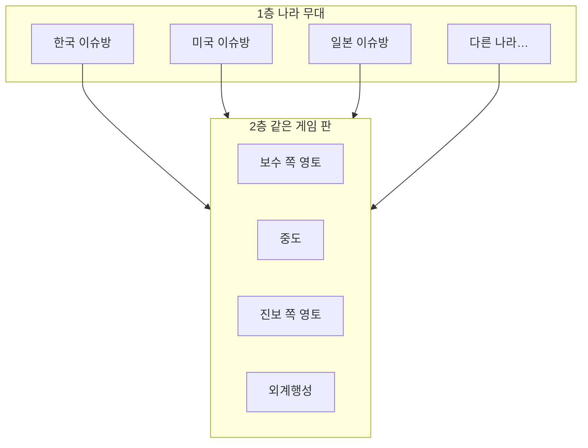

# 영토를 여러 나라에 맞게 나누는 방법 (쉬운 설계 메모)

## 한 줄 요약

**나라** = 언어·법·뉴스 이슈가 다른 **“무대 번호”**  
**영토(보수–중도–진보 + 외계행성)** = 글로 싸우는 **“같은 규칙의 게임 판”**  
→ 나라마다 정부 형태가 달라도, **게임 판의 모양은 통일**하고, **표현·해석만 나라별로** 바꿉니다.

---

## 왜 이렇게 하나요?

미국·한국·일본은 **정당 이름·이슈·말투**가 다릅니다.  
그래서 “한국식 보수 = 미국식 보수”로 **딱 맞추면** 싸움이 납니다.

대신 이렇게 나눕니다.

| 층 | 의미 (쉬운 말) |
|----|----------------|
| **1층 — 나라** | 로그인·가입 때 고른 곳. 여기서 **언어, 화폐, 광고 규칙, 신고 기준** 같은 걸 맞춤. |
| **2층 — 영토(진영)** | “글 기울기”로 모는 **보수 / 중도 / 진보 / 외계행성(극단)”**. 나라와 **별개**인 **게임 축**입니다. |

---

## 그림 — 두 층

- 유저는 **나라**를 고르고, 그 나라 **게시판 묶음**에서 글을 씁니다.  
- **점수·편입**은 같은 **좌–중–우 축**으로 쌓입니다. (센텐스크래프트 규칙 유지)

---

## 영토를 “어떻게 나눌지” — 추천 3가지

### 추천 ① (가장 단순, 지금 기획과 잘 맞음)

**전 세계 공통:**  
`보수 영토 | 중도 | 진보 영토 | 외계행성(좌·우)` **그대로 하나의 판**

**나라마다 다른 것:**  
- 화면에 보이는 **한글 이름**(예: 미국판에서는 다른 라벨)  
- AI·분석이 참고하는 **키워드·뉴스 출처**  
- “입당 추천서” 문구

→ DB에는 `country_code` + `spectrum_zone` 같이 **두 개 칼럼**만 있으면 됩니다.

### ② 나라마다 “말만” 다른 템플릿

예:  
- 나라 A → 보수 영토 버튼에 **“우파 성향 무대”**  
- 나라 B → 같은 자리에 **“보수 계열 토론장”**  

**판의 개수·규칙은 같고**, **번역·문화만** 바꿉니다.

### ③ (나중에) 나라별 “세부 칸”만 추가

같은 보수 영토 안에 **“하원 / 여당 / 야당”** 같은 칸을 **일부 나라만** 켭니다.  
처음부터 넣으면 복잡하니, **①이 잘 된 뒤**에 고려하면 좋습니다.

---

## 회원가입 때 “나라 선택”과 연결

1. 가입 시 **나라 고름** → `profiles` 같은 데 `home_country` 또는 `locale_country` 로 저장 (지금 SQL도 비슷한 생각).  
   나라 목록은 서버 `/api/public-config` 의 **`signupCountries`** 와 맞추면 됩니다.
2. 글/댓글마다 **어느 나라 무대에 올렸는지** 저장 (대부분 가입 나라와 같게 시작).  
3. **정치색 점수**는 “글 내용 + 반응”으로 계산하되, **그 나라용 사전·가중치**를 나중에 붙일 수 있게 설계만 열어 둠.

---

## 정리

- **영토(진영) 축은 전 세계 통일**해 두고,  
- **나라는 ‘무대·법·언어’만** 나누는 게, 개발도 쉽고 운영도 덜 꼬입니다.  
- “이 나라는 정당이 셋이다” 같은 건 **1층 나라 쪽 ‘토론 주제·서브보드’**로 풀고, **편입 축은 그대로** 두는 걸 추천합니다.

이 문서는 `docs/영토_다국가_설계.md` 에 저장해 두었습니다. 다음에 DB 표를 만들 때 여기 내용을 기준으로 잡으면 됩니다.
