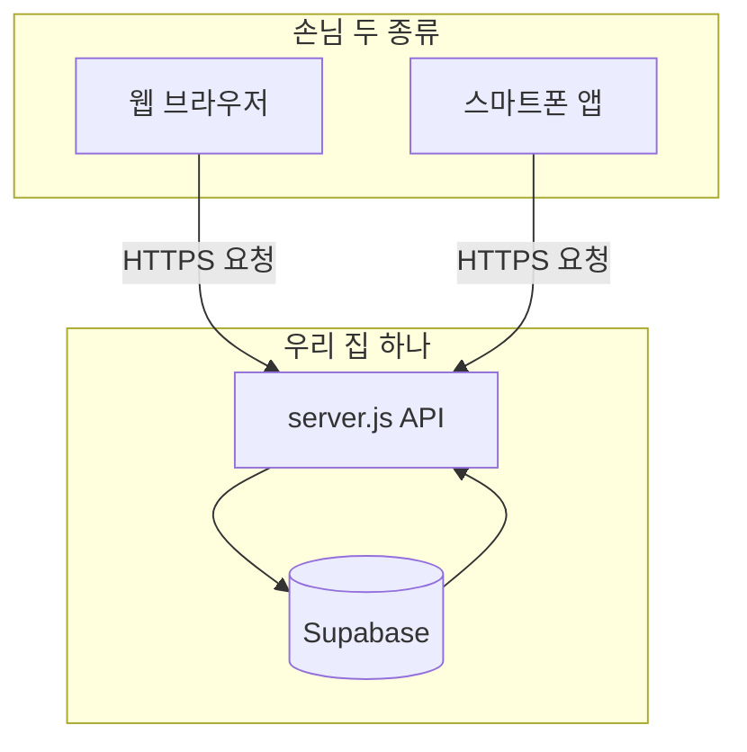

# 웹 + 앱, 같이 쓰는 방법 (쉬운 말)

## 한 줄 요약

**웹이든 앱이든 “같은 주소의 API”만 부르면 됩니다.**  
지금 있는 **`server.js` + Supabase** 가 그 **공통 집**이에요.

---

## 그림으로

- **웹**: 지금처럼 `public/` 화면이 `fetch('/api/...')` 하면 됨.  
- **앱**: 나중에 React Native / Flutter 등에서 **똑같이** `https://우리서버주소/api/...` 만 부르면 됨.

---

## 지키면 좋은 규칙 (나중에 안 꼬이게)

| 규칙 | 쉬운 말 |
|------|---------|
| **규칙·숫자는 한곳** | `config/`, `app-config.js`, `/api/public-config` — 웹·앱 둘 다 여기만 믿기 |
| **비밀 열쇠는 앱·웹 코드에 안 넣기** | `service_role` 같은 건 **서버·Supabase 대시보드**에만 |
| **회원가입·로그인** | 지금처럼 **서버가 Supabase랑 통신**하게 두면, 앱도 같은 API만 쓰면 됨 |
| **나중에 앱 스토어** | 실제 주소는 `https://api.도메인.com` 처럼 **고정 주소** 하나로 통일하는 게 편함 (지금은 `localhost` 연습) |

---

## 앱 폴더는 아직 없어도 됨

지금 저장소는 **웹 + 서버** 중심이에요.  
앱 프로젝트는 **새 폴더**(예: `mobile/`)로 나중에 만들어도 되고, **완전 다른 저장소**로 만들어도 됩니다.  
중요한 건 **둘 다 같은 API 주소**를 바라보게 하는 것뿐이에요.

---

## 다음에 하면 좋은 일 (순서대로)

1. **API 목록**을 한 페이지에 적어 두기 (가입, 로그인, 내 프로필…) — 이미 `server.js` 맨 위 주석에 있음  
2. 앱 만들 때 **그 주소만** 복사해서 연결  
3. 서버를 인터넷에 올릴 때(배포) **HTTPS** 켜기 — 앱·웹 모두 안전

이 파일은 `docs/웹과앱_같이쓰기.md` 에 저장해 두었습니다.
