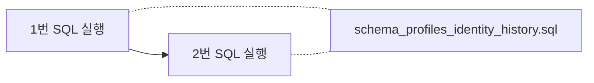

# Supabase — “지우고 다시 깔기” 순서 (쉬운 말)

## 언제 이렇게 하나요?

예전에 제미나이 등으로 **SQL이 꼬였을 때**, 우리 프로젝트에 있는 설계도만 **다시 맞추고 싶을 때**입니다.

---

## 순서 (2번만 기억하면 됨)

| 순서 | 파일 | 하는 일 |
|------|------|-----------|
| **1** | `supabase/drop_profiles_identity_schema.sql` | 표·트리거·함수 **지우기** (한 번에 정리) |
| **2** | `supabase/schema_profiles_identity_history.sql` | **새로** 표·트리거·함수·정책 **만들기** |

각 파일을 **통째로 복사** → Supabase **SQL Editor** → **Run** 한 번씩이면 됩니다.

---

## 주의

- **1번**을 하면 `profiles` / `identity_history` **안에 있던 글·명함 데이터는 전부 사라집니다.**
- **로그인 계정(`auth.users`)** 은 1번만으로는 안 지워집니다.  
  계정까지 없애려면 대시보드 **Authentication → Users** 에서 직접 지우세요.
- **2번만** 새로 돌렸다면: `migration_home_country_iso.sql` 은 **안 돌려도 됩니다.**  
  (메인 스키마에 이미 ISO 나라 코드 규칙이 들어 있습니다.)  
  **예전에 KR/JP/US만 있던 오래된 DB**를 고칠 때만 마이그레이션 파일을 씁니다.

---

## 끝난 뒤 확인

1. **Table Editor**에 `profiles`, `identity_history`가 보이는지  
2. **Authentication**에서 테스트 가입 한 번 → `profiles`에 **한 줄** 생기는지
